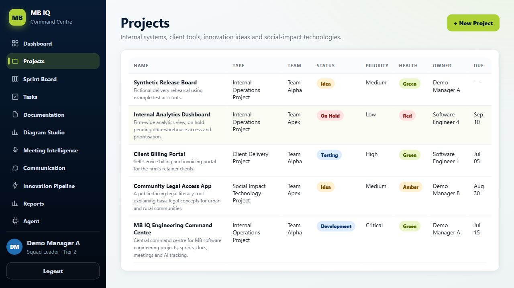
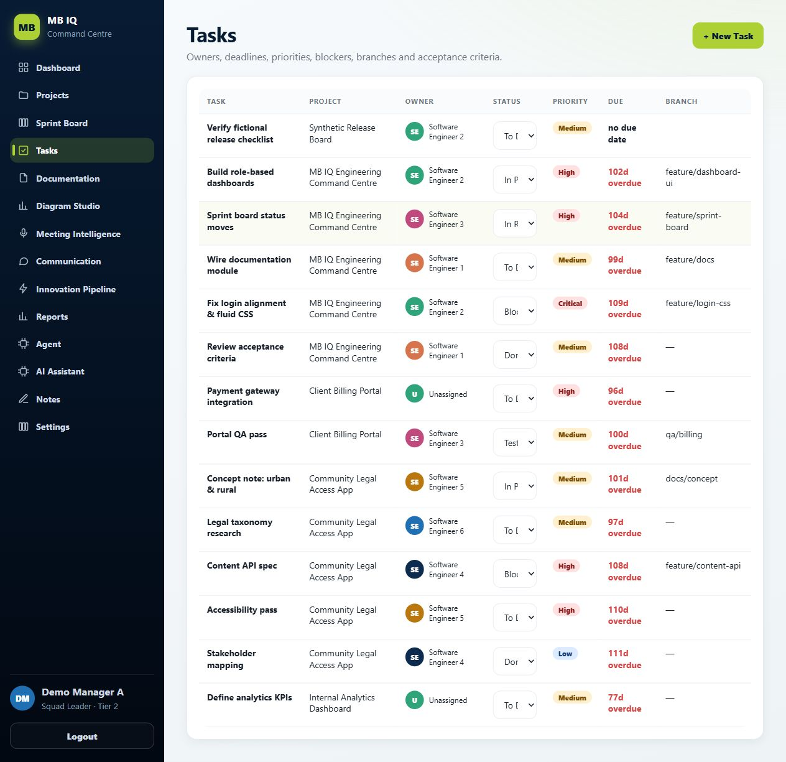
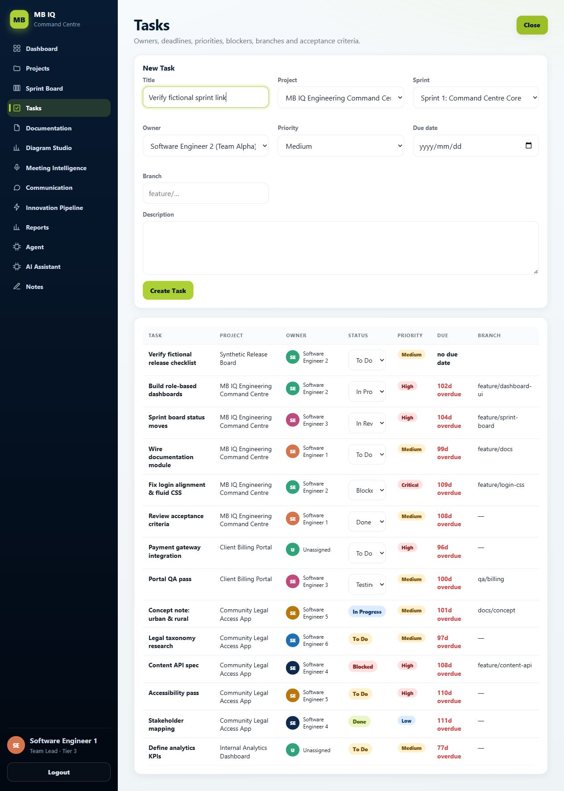
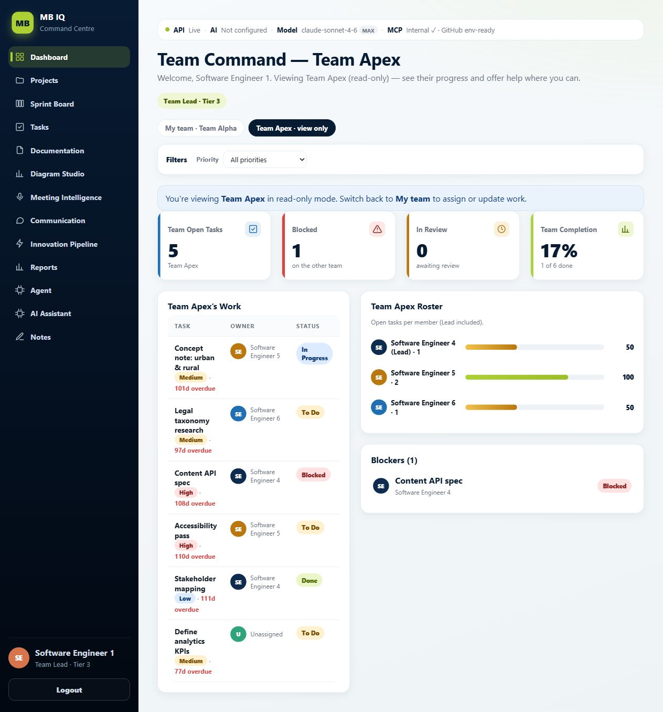
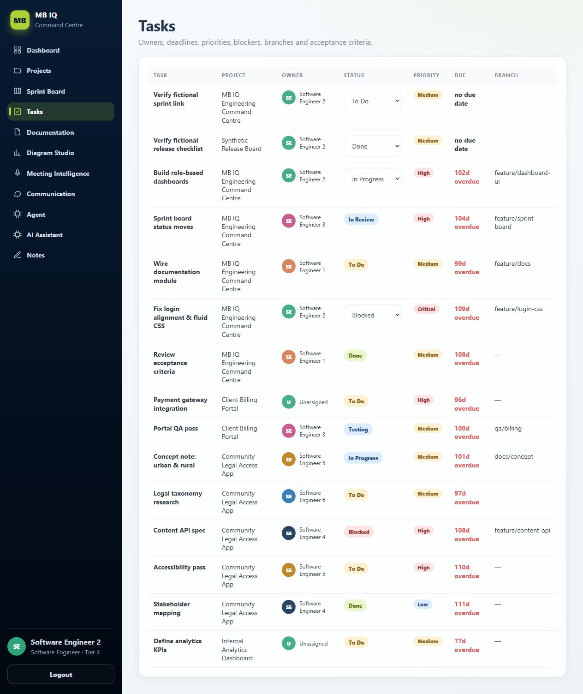
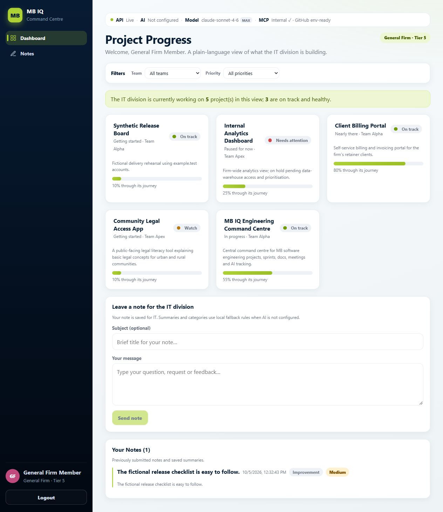

# Synthetic delivery walkthrough

This walkthrough uses fictional staff and delivery work to demonstrate MB IQ's
local engineering workflow. It covers a manager opening a project, a Team Lead
assigning sprint work, an engineer moving its task, and a General Firm member
leaving feedback. It makes no live AI, SSO or production deployment claim.

## Start a disposable instance

Use Node 22.12 or newer. From a new checkout:

```bash
git clone https://github.com/konethegreat/MB-IQ.git
cd MB-IQ
npm ci --prefix backend
npm ci --prefix frontend
node scripts/demo.mjs
```

The same commands work in PowerShell. No `.env` setup is required. Open
**http://127.0.0.1:4176** and use the generated password printed in that terminal.
The password applies only to this run's fictional accounts; it is newly generated
on each launch. Keep port 4176 free. The API uses an available loopback port and
the browser requests reach it through Vite's preview `/api` proxy.

The launcher builds the frontend and creates a SQLite database under the OS temporary directory with a
`mbiq-synthetic-` prefix. It overrides inherited database, auth, seed, JWT and
provider settings for its child processes. Anthropic and GitHub MCP are empty,
and the frontend ignores `.env` API overrides. Existing repository `.env` files
and databases are not edited or seeded. Both servers bind to `127.0.0.1`.

Wait for the ready message before starting. When finished, press **Ctrl+C** in
that terminal to stop both servers and delete this run's database and compiled
frontend. The launcher does not alter the project's `frontend/dist` output.
Relaunching resets the fictional work. A forced process kill or power failure
can leave its printed temporary directory behind.

## Fictional roles

All emails use the reserved `example.test` domain.

| Account | Role | Workflow |
| --- | --- | --- |
| `leader@example.test` | Final Leader, Tier 1 | Department oversight |
| `manager-a@example.test` | Squad Leader, Tier 2 | Projects and delivery across both squads |
| `engineer1@example.test` | Team Lead, Tier 3 | Alpha task/sprint management |
| `engineer4@example.test` | Team Lead, Tier 3 | Apex task/sprint management |
| `engineer2@example.test` | Software Engineer, Tier 4 | Status changes for assigned work |
| `engineer3@example.test` | Software Engineer, Tier 4 | Another Alpha owner for reassignment checks |
| `staff@example.test` | General Firm, Tier 5 | Project progress and its own feedback |

The seed contains ten accounts in total, four fictional projects, two sprints
and thirteen tasks. Its fixed June–September 2026 dates intentionally show
overdue work when viewed later. They are sample data, not current delivery dates.

## Manager: open a project and assign a task

1. Sign in as `manager-a@example.test`. Open **Projects → + New Project**.
2. Enter **Synthetic Release Board**, select **Team Alpha**, and use the
   description **Fictional delivery rehearsal using example.test accounts.**
3. Click **Create Project**. The portfolio shows the project with Demo Manager A
   as its owner.
4. Open **Tasks → + New Task**. Enter **Verify fictional release checklist**,
   select **Synthetic Release Board**, and assign **Software Engineer 2 (Team
   Alpha)**. Leave **Sprint** as **No sprint** for this new project. Click
   **Create Task** and confirm it appears as **To Do**.





## Team Lead: assign work in an existing sprint

1. Log out and sign in as `engineer1@example.test`.
2. Open **Tasks → + New Task**. Enter **Verify fictional sprint link**, select
   **MB IQ Engineering Command Centre**, **Sprint 1: Command Centre Core**, and
   **Software Engineer 2 (Team Alpha)**. Click **Create Task**.
3. Project, owner and sprint options stay within Alpha for this role. Selecting
   another project resets the sprint choice; linked sprints must match it.
4. Open **Dashboard → Team Apex · view only**. The other squad remains visible
   for awareness, with a read-only notice and no assignment/status controls.
   The Tasks table and Sprint Board also hide editing controls for Apex work.





Sprint creation is currently an API capability; there is no new-sprint form in
this UI. The HTTP regression creates a fresh project/sprint pair, assigns a task
to both and verifies the saved relationship and sprint count. The browser steps
use the seeded sprint to show the available form without inventing a UI feature.

## Engineer: deliver assigned work

1. Log out and sign in as `engineer2@example.test`. Open **Tasks**.
2. Move **Verify fictional release checklist** through **In Progress → In
   Review**. Reload and confirm **In Review** persists.
3. Open **Sprint Board**, move the same task to **Done**, then return to Tasks
   and reload. Confirm **Done** persists.
4. Other engineers' tasks stay visible without editing controls. This role has
   no **+ New Task** button. The server permits only status changes on owned
   tasks; attempted changes to title, priority or ownership are ignored.



Managers and Team Leads can reassign permitted work. The HTTP regression also
checks that the old owner loses write access after reassignment and the new
owner can complete the task.

## General Firm: follow progress and leave feedback

1. Log out and sign in as `staff@example.test`. Its navigation contains only
   **Dashboard** and **Notes**. The dashboard shows project progress.
2. Leave the subject **Synthetic release feedback** and message **The fictional
   release checklist is easy to follow.** Click **Send note**.
3. Reload. **Your Notes (1)** retains the saved message. The IT roles can see
   the same note in their inbox; the General Firm role cannot read that inbox.



The dashboard's progress percentages are fixed mappings from project stages,
not task completion percentages. Completing a task does not promote the project
stage automatically. Note summaries/categories in this instance use local
fallback rules. **AI Not configured** is the expected state.

## Repeatable checks and evidence

```bash
npm run build --prefix backend
npm run test:workflow --prefix backend
npm run build --prefix frontend
# Stop the interactive demo first so port 4176 is free:
node scripts/demo.mjs --check
npm audit --prefix backend --audit-level=moderate
npm audit --prefix frontend --audit-level=moderate
```

The HTTP test runs against an independent temporary database and actual Express
routes, JWTs and Prisma writes. It also runs the existing ten-account verification
and deterministic diagram/risk/standup checks. It covers:

- Successful role login, wrong passwords, absent sessions and forged tokens.
- Manager project creation and Team Lead sprint/task assignment with valid links.
- Cross-team and missing-team write denial, including owner-only tasks, forged
  sprint/project pairs and attempted takeover of unscoped department work.
- Unknown relationships/statuses, allowed cross-team reads, status persistence,
  reassignment and task/sprint counts.
- General Firm progress-only payloads, protected routes, feedback history/inbox
  persistence, disabled providers and zero recorded AI calls/cost.

CI runs the API checks on Windows/Linux with Node 22/24, and the frontend build
and Vite/proxy launcher smoke on Linux with Node 22. The launcher smoke checks
HTTP startup, the compiled entry bundle, API proxying and cleanup; manual browser checks supply
the screenshots above. They are local evidence, not automated browser coverage.

The initial regression reproduced missing sprint write scope, ignoring `sprintId`
on task creation, and Team Leads editing another squad's owner-only tasks or
claiming unscoped tasks. The corrected routes reject those requests. Scope checks
use every existing project, sprint and owner context; ambiguous department work
requires a manager. No full security audit, SSO integration, external provider,
real notification delivery or production deployment was exercised here.
